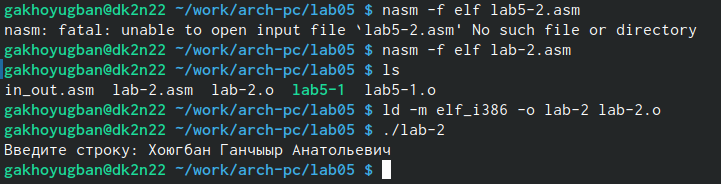

---
## Front matter
title: "Шаблон отчёта по лабораторной работ №5"
subtitle: "Дисциплина: архитектура компьютера"
author: "Хоюгбан Ганчыыр Анатольевич"

## Generic otions
lang: ru-RU
toc-title: "Содержание"

## Bibliography
bibliography: bib/cite.bib
csl: pandoc/csl/gost-r-7-0-5-2008-numeric.csl

## Pdf output format
toc: true # Table of contents
toc-depth: 2
lof: true # List of figures
lot: true # List of tables
fontsize: 12pt
linestretch: 1.5
papersize: a4
documentclass: scrreprt
## I18n polyglossia
polyglossia-lang:
  name: russian
  options:
	- spelling=modern
	- babelshorthands=true
polyglossia-otherlangs:
  name: english
## I18n babel
babel-lang: russian
babel-otherlangs: english
## Fonts
mainfont: PT Serif
romanfont: PT Serif
sansfont: PT Sans
monofont: PT Mono
mainfontoptions: Ligatures=TeX
romanfontoptions: Ligatures=TeX
sansfontoptions: Ligatures=TeX,Scale=MatchLowercase
monofontoptions: Scale=MatchLowercase,Scale=0.9
## Biblatex
biblatex: true
biblio-style: "gost-numeric"
biblatexoptions:
  - parentracker=true
  - backend=biber
  - hyperref=auto
  - language=auto
  - autolang=other*
  - citestyle=gost-numeric
## Pandoc-crossref LaTeX customization
figureTitle: "Рис."
tableTitle: "Таблица"
listingTitle: "Листинг"
lofTitle: "Список иллюстраций"
lotTitle: "Список таблиц"
lolTitle: "Листинги"
## Misc options
indent: true
header-includes:
  - \usepackage{indentfirst}
  - \usepackage{float} # keep figures where there are in the text
  - \floatplacement{figure}{H} # keep figures where there are in the text
---

# Цель работы

Приобретение практических навыков работы в Midnight Commander. Освоение инструкций языка ассемблера mov и int.

# Выполнение лабораторной работа 

Я открыл терминал и через команду "mc" открыл "Midnight Commander"(рис. [fig:001])

{#fig:001 width=70%}

Перехожу через клавиатуру в каталог "lab05"(рис. [fig:002])

{#fig:002 width=70%}

Текст программы для вывода сообщения на экран и ввода строки с клавиатуры(рис. [fig:003])

{#fig:003 width=70%}

Проверяю появился ли файл "lab5-1.asm"(рис. [fig:004])

{#fig:004 width=70%}

Отранслировал текст программы lab5-1.asm в объектный файл, выполнил компоновку и запустил получившийся файл на исполнение. Программа вывела мне "введите строку", куда я ввел свое ФИО(рис. [fig:005]).

{#fig:005 width=70%}

Создаю файл lab5-2.asm и изменяю в нем текст, который я приложу в следующем рисунке. Отранслировал текст прогрммы lab5-2.asm в объектный файл, его компоновка и отправление на исполнение файла(рис. [fig:006]).

{#fig:006 width=70%}

Текст программы для вывода сообщения на экран и ввода строки с клавиатуы(файл lab5-2.asm)(рис. [fig:007]).

{#fig:007 width=70%}

#Задание для самостоятельной работы

Для пункта 1 я создал файл lab5-1-1.asm, где ввел текст на рисунке(рис. [fig:008]).

{#fig:008 width=70%}

Затем я отранслировал текст программы lab5-1-1.asm, сделал его компоновку и отправил на исполнение. После выполнения, получив "введите строку", по условию самостоятельной я ввел свою фамилию(пункт 2)(рис. [fig:009]).

{#fig:009 width=70%}

Для 3 пункта я создал файл "lab-2.asm", для которого я ввел текст на рисунке(рис. [fig:010]).

{#fig:010 width=70%}

Отрансилоровал текст программы "lab-2.asm", сделал компоновку и отправил на исполнение. На выходе мне надо было ввести строку, куда я ввел свое ФИО. Затем я получил такую же строчку, то есть свое ФИО, а значит по условию у меня все получилось(рис. [fig:011]).

{#fig:011 width=70%}

#Вывод

При выполнении данной лабораторной работы я приобрел практические навыки в Midnight Commander, а также освоил инструкции языка ассемблера mov и int.
