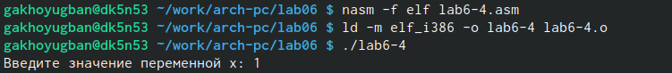

---
## Front matter
title: "Отчёта по лабораторной работе №6"
subtitle: "Дисциплина: Архитектура компьютера"
author: "Хоюгбан Ганчыыр Анатольевич"

## Generic otions
lang: ru-RU
toc-title: "Содержание"

## Bibliography
bibliography: bib/cite.bib
csl: pandoc/csl/gost-r-7-0-5-2008-numeric.csl

## Pdf output format
toc: true # Table of contents
toc-depth: 2
lof: true # List of figures
lot: true # List of tables
fontsize: 12pt
linestretch: 1.5
papersize: a4
documentclass: scrreprt
## I18n polyglossia
polyglossia-lang:
  name: russian
  options:
	- spelling=modern
	- babelshorthands=true
polyglossia-otherlangs:
  name: english
## I18n babel
babel-lang: russian
babel-otherlangs: english
## Fonts
mainfont: PT Serif
romanfont: PT Serif
sansfont: PT Sans
monofont: PT Mono
mainfontoptions: Ligatures=TeX
romanfontoptions: Ligatures=TeX
sansfontoptions: Ligatures=TeX,Scale=MatchLowercase
monofontoptions: Scale=MatchLowercase,Scale=0.9
## Biblatex
biblatex: true
biblio-style: "gost-numeric"
biblatexoptions:
  - parentracker=true
  - backend=biber
  - hyperref=auto
  - language=auto
  - autolang=other*
  - citestyle=gost-numeric
## Pandoc-crossref LaTeX customization
figureTitle: "Рис."
tableTitle: "Таблица"
listingTitle: "Листинг"
lofTitle: "Список иллюстраций"
lotTitle: "Список таблиц"
lolTitle: "Листинги"
## Misc options
indent: true
header-includes:
  - \usepackage{indentfirst}
  - \usepackage{float} # keep figures where there are in the text
  - \floatplacement{figure}{H} # keep figures where there are in the text
---

# Цель работы

Освоение арифметических инструкций языка ассемблера NASM.

# Теоретическое введение

Здесь описываются теоретические аспекты, связанные с выполнением работы.

Например, в табл. @tbl:std-dir приведено краткое описание стандартных каталогов Unix.

: Описание некоторых каталогов файловой системы GNU Linux {#tbl:std-dir}

| Имя каталога | Описание каталога                                                                                                          |
|--------------|----------------------------------------------------------------------------------------------------------------------------|
| `/`          | Корневая директория, содержащая всю файловую                                                                               |
| `/bin `      | Основные системные утилиты, необходимые как в однопользовательском режиме, так и при обычной работе всем пользователям     |
| `/etc`       | Общесистемные конфигурационные файлы и файлы конфигурации установленных программ                                           |
| `/home`      | Содержит домашние директории пользователей, которые, в свою очередь, содержат персональные настройки и данные пользователя |
| `/media`     | Точки монтирования для сменных носителей                                                                                   |
| `/root`      | Домашняя директория пользователя  `root`                                                                                   |
| `/tmp`       | Временные файлы                                                                                                            |
| `/usr`       | Вторичная иерархия для данных пользователя                                                                                 |

Более подробно об Unix см. в [@gnu-doc:bash;@newham:2005:bash;@zarrelli:2017:bash;@robbins:2013:bash;@tannenbaum:arch-pc:ru;@tannenbaum:modern-os:ru].

# Выполнение лабораторной работы

(рис. @fig:001)
{#fig:001 width=70%}

Для начала я перешел в свой каталог, который имеет такой путь: ~/work/arch-pc/lab06. В этом каталоге я создал файл lab6-1.asm.  В него я ввел текст программы на рисунке(рис. @fig:001)

{#fig:001 width=70%}

Затем я отранслировал программу в объектный файл, отправл на компоновку и провел исполнение этого файла в действии. На выходе я получил просто j(рис. @fig:002)

{#fig:002 width=70%}

Я изменил код программы в том же файле, как было сказано по условию. То есть я убрал кавычки у 4 и 6, что я показываю на рисунке(рис. @fig:003)

{#fig:003 width=70%}

Я отранслировал файл в объектный, отправил его на компоновку и также отправил на исполнение, где получил вместо ответа пустоту(рис. @fig:004)

{#fig:004 width=70%}

Я создал новый файл lab6-2.asm. В него я ввел текст для программы вывода значения регистра eax, что я показа на рисунке(рис. @fig:005)

{#fig:005 width=70%}

Я отранслировал текст программы файла lab6-2.asm в объектный файл, отправил на компоновку и провел исполнение программы, где получил 106(рис. @fig:006)

{#fig:006 width=70%}

Затем, как было сказано по условию, я изменил текст программы, то есть убрал кавычки у 6 и 4. На рисунке текст программы(рис. @fig:007)

{#fig:007 width=70%}

Я отранслировал файл в объектный, отправил его на компоновку и отправил на исполнение, где получил ответ просто 10(рис. @fig:008)

{#fig:008 width=70%}

Для начала я создал файл lab6-3.asm(рис. @fig:009)

{#fig:009 width=70%}

По условию лабораторной работы я переписал программу в мой файл lab6-3.asm программу вычисления выражения f(x) = (5 * 2 + 3)/3(рис. @fig:010)

{#fig:010 width=70%}

Я отранслировал файл lab6-3.asm в объектный файл, првоел компановку и отправил на исполнение, откуда и получил правильные ответы из условий лабораторной работы(рис. @fig:011)

{#fig:011 width=70%}

Затем мне надо было написать текст для программы вычисления выражения f(x) = (4 * 6 + 2)/5. Код программы на рисунке(рис. @fig:012)

{#fig:012 width=70%}

Измененый файл lab6-3.asm я отранслиовал в объектный файл, провел его компановку и отправил на исполнение, откуда получил правильный ответы из условия лабораторной работы(рис. @fig:013)

{#fig:013 width=70%}

Для 7 пункта я создал новый файл variant.asm. Затем я переписал предложенный текст программы, который я продемонстрирую вам на следующем рисунке(рис. @fig:014)

{#fig:014 width=70%}

Я отранслировал файл variant.asm в объектный, провел его компоновку и отправил на исполнение. Мне предложили ввести мой студенческий, что я сделал. Затем я получил 20 вариант(рис. @fig:015)

{#fig:015 width=70%}

По условию лабораторной работы меня попросили ответить на 7 вопросов, что я и сделаю:

1)За вывод сообщения "Ваш вариант" отвечают строки кода:
mov eax,rem
call sprint
2)Инструкция mov ecx, x используется, чтобы положить адрес вводимой строки x в регистр ecx mov edx, 80 - запись в регистр edx длины вводимой строки call sread - вызов подпрограммы из внешнего файла, обеспечивающей ввод сообщения с клавиатуры
3)call atoi используется для вызова подпрограммы из внешнего файла, которая преобразует ascii-код символа в целое число и записывает результат в регистр eax
4)За вычисления варианта отвечают строки:
xor edx,edx ; обнуление edx для корректной работы div
mov ebx,20 ; ebx = 20
div ebx ; eax = eax/20, edx - остаток от деления
inc edx ; edx = edx + 1
5)При выполнении инструкции div ebx остаток от деления записывается в регистр edx
6)Инструкция inc edx увеличивает значение регистра edx на 1
7)За вывод на экран результатов вычислений отвечают строки:
mov eax,edx
call iprintLF

#Выполнение самостоятельной работы

Так как по ходу лабораторной работы мне выпал 20 вариант, мне выпадает написать текст для программы вычисления выражения f(x) = x^3 *1/3 + 21. Значит для начала я создам файл lab6-4.asm, в котором будет текст моего кода(рис. @fig:016)

{#fig:016 width=70%}

Для успешного получения правильного решения, я ввел вот такой текст программы(рис. @fig:017)

{#fig:017 width=70%}

Я отранслировал текст файла lab6-4.asm в объектный, провел компоновку и отправил на исполнение. Для начала я ввел значение 1 для моего х, откуда получаю ответ 21, что по моим расчетам верно(рис. @fig:018)

{#fig:018 width=70%}

Я отранслировал текст файла lab6-4.asm в объектный, провел компоновку и отправил на исполнение. Теперь я введу 3 для моего значения, откуда получаю ответ 30, что по моим расчетам верно(рис. @fig:019)

{#fig:019 width=70%}

#Вывод

При выполнении данной лабораторной работы я освоил арифметические инструкции языка ассемблера NASM.

