---
## Front matter
title: "Отчёт по лабораторной работе №7"
subtitle: "Дисциплина: Архитектура компьютера"
author: "Хоюгбан Ганчыыр Анатольевич"

## Generic otions
lang: ru-RU
toc-title: "Содержание"

## Bibliography
bibliography: bib/cite.bib
csl: pandoc/csl/gost-r-7-0-5-2008-numeric.csl

## Pdf output format
toc: true # Table of contents
toc-depth: 2
lof: true # List of figures
lot: true # List of tables
fontsize: 12pt
linestretch: 1.5
papersize: a4
documentclass: scrreprt
## I18n polyglossia
polyglossia-lang:
  name: russian
  options:
	- spelling=modern
	- babelshorthands=true
polyglossia-otherlangs:
  name: english
## I18n babel
babel-lang: russian
babel-otherlangs: english
## Fonts
mainfont: PT Serif
romanfont: PT Serif
sansfont: PT Sans
monofont: PT Mono
mainfontoptions: Ligatures=TeX
romanfontoptions: Ligatures=TeX
sansfontoptions: Ligatures=TeX,Scale=MatchLowercase
monofontoptions: Scale=MatchLowercase,Scale=0.9
## Biblatex
biblatex: true
biblio-style: "gost-numeric"
biblatexoptions:
  - parentracker=true
  - backend=biber
  - hyperref=auto
  - language=auto
  - autolang=other*
  - citestyle=gost-numeric
## Pandoc-crossref LaTeX customization
figureTitle: "Рис."
tableTitle: "Таблица"
listingTitle: "Листинг"
lofTitle: "Список иллюстраций"
lotTitle: "Список таблиц"
lolTitle: "Листинги"
## Misc options
indent: true
header-includes:
  - \usepackage{indentfirst}
  - \usepackage{float} # keep figures where there are in the text
  - \floatplacement{figure}{H} # keep figures where there are in the text
---

# Цель работы

Изучение команд условного и безусловного переходов. Приобретение навыков написания
программ с использованием переходов. Знакомство с назначением и структурой файла
листинга.

# Теоретическое введение

Для реализации ветвлений в ассемблере используются так называемые команды передачи
управления или команды перехода. Можно выделить 2 типа переходов:
• условный переход – выполнение или не выполнение перехода в определенную точку
программы в зависимости от проверки условия.
• безусловный переход – выполнение передачи управления в определенную точку про-
граммы без каких-либо условий.

# Выполнение лабораторной работы

Для начала я зашел в терминал, перешел в свой каталог по путю ~/work/arch-pc, создал в нем каталог lab07, а в нем уже создал файл lab7-1.asm(рис. @fig:001).

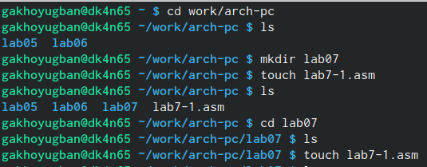{#fig:001 width=70%}

В этом файле я написал текст программы с использованием инструкции jmp(рис. @fig:002).

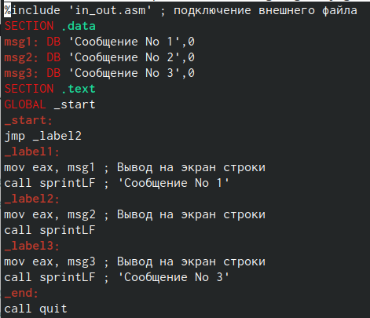{#fig:002 width=70%}

Я оттрансдировал даннный файл lab7-1.asm в объектный, выполнил компоновку и отрпавил на исполнение. B результате мне выдало правилный ответ по условиям лабораторной работы, что мне сначала выдало 2 сообщение, а затем 3(рис. @fig:003).

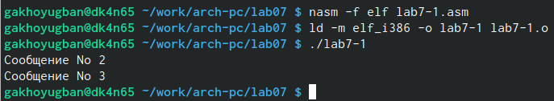{#fig:003 width=70%}

Я изменил текст файла lab7-1.asm и написал такой текст программы, чтобы мне поочередно выдали сообщения 3, 2, 1(рис. @fig:004).

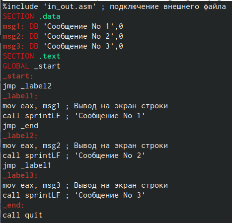{#fig:004 width=70%}

Я оттрансдировал даннный изменненный файл lab7-1.asm в объектный, выполнил компоновку и отрпавил на исполнение. B результате мне выдало правилный ответ по условиям лабораторной работы, что мне сначала выдало 3 сообщение, а затем 2 и потом уже 1 сообщение(рис. @fig:005).

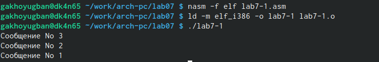{#fig:005 width=70%}

Я создал файл lab7-2.asm, ввел в него текст программы, которая определяет и выводит на экран наибольшую из 3 целочисленных переменных: A,B и C(рис. @fig:006).

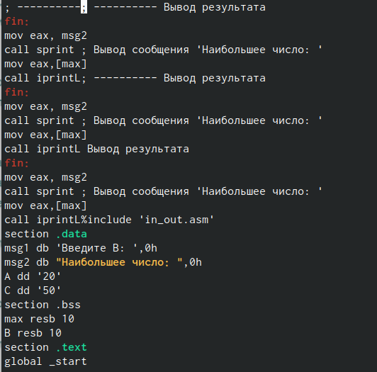{#fig:006 width=70%}

Я оттрансдировал даннный файл lab7-2.asm в объектный, выполнил компоновку и отрпавил на исполнение. Затем я ввел пару значений, в ходе которых я пришел к такому выводу, что все введенные числа больше 50 будут наибольшими. Если ввести число меньше 50, то наибольшим для него будет 50(рис. @fig:007).

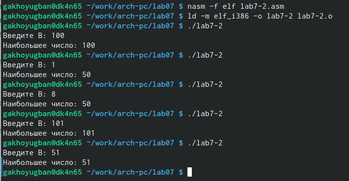{#fig:007 width=70%}

Я указал ключ -l и задал имя файла листинга в командной строке, создал файл листинга lab7-2.lst и открыл его с помощью команды mcedit(рис. @fig:008).

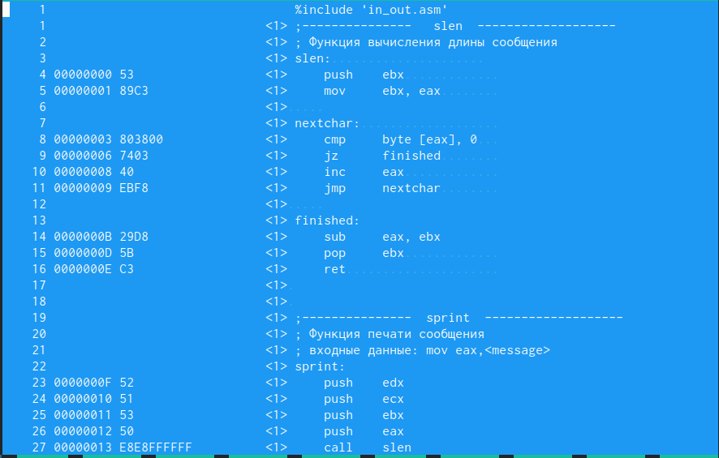{#fig:008 width=70%}

По условию лабораторной мне надо объяснить 3 строки из файла листинга lab7-2.asm:
1)В строке 11 содержится номер сторки [11], адресс [00000008], машинный код [40] и содержимое строки кода [inc eax]
2)В строке 9 содержится собственно номер сторки [9], адресс [00000003], машинный код [803800] и содержимое строки кода [cmp byte [eax], 0]
3)В строке 24 содержится номер сторки [24], адресс [0000000F], машинный код [52] и содержимое строки кода [push edx]

По условию лабораторной мне надо было в файле lab7-2.asm найти строку, где производится действия над двумя операндами и удалить один из них. Затем надо оттранслировать, отправить на компоноку и отправить на исполнение. Но, так как я допустил ошибку выше, мне выдаст ошибку, которую я демонстрирую на рисунке(рис. @fig:009).

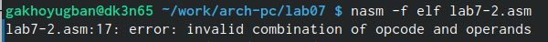{#fig:009 width=70%}

# Выполнение самостоятельной работы 

Для начала я создал файл lab7-3.asm, а затем напечатал для первого пункта программу нахождения наименьшей из 3 целочисленных переменных 𝑎,𝑏 и c. Текст программы на рисунке(рис. @fig:010).

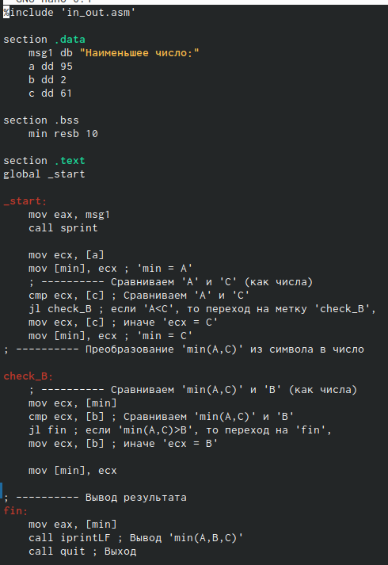{#fig:010 width=70%}

Затем я оттрансдировал  файл lab7-3.asm в объектный, выполнил компоновку и отрпавил на исполнени. В результате мне выдало правильное значение, а именно 2, так как среди 95, 2, 61 оно будет самым наименьшим(рис. @fig:011).

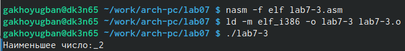{#fig:011 width=70%}

# Выводы

Были изучены основные принципы работы с условным и безусловным переходом в assembler и изучены основы чтения файлов листинга.

