---
## Front matter
title: "Отчёт по лабораторной работе №8"
subtitle: "Дисцпилина: Архитектура компьютера"
author: "Хоюгбан Ганчыыр Анатольевич"

## Generic otions
lang: ru-RU
toc-title: "Содержание"

## Bibliography
bibliography: bib/cite.bib
csl: pandoc/csl/gost-r-7-0-5-2008-numeric.csl

## Pdf output format
toc: true # Table of contents
toc-depth: 2
lof: true # List of figures
lot: true # List of tables
fontsize: 12pt
linestretch: 1.5
papersize: a4
documentclass: scrreprt
## I18n polyglossia
polyglossia-lang:
  name: russian
  options:
	- spelling=modern
	- babelshorthands=true
polyglossia-otherlangs:
  name: english
## I18n babel
babel-lang: russian
babel-otherlangs: english
## Fonts
mainfont: PT Serif
romanfont: PT Serif
sansfont: PT Sans
monofont: PT Mono
mainfontoptions: Ligatures=TeX
romanfontoptions: Ligatures=TeX
sansfontoptions: Ligatures=TeX,Scale=MatchLowercase
monofontoptions: Scale=MatchLowercase,Scale=0.9
## Biblatex
biblatex: true
biblio-style: "gost-numeric"
biblatexoptions:
  - parentracker=true
  - backend=biber
  - hyperref=auto
  - language=auto
  - autolang=other*
  - citestyle=gost-numeric
## Pandoc-crossref LaTeX customization
figureTitle: "Рис."
tableTitle: "Таблица"
listingTitle: "Листинг"
lofTitle: "Список иллюстраций"
lotTitle: "Список таблиц"
lolTitle: "Листинги"
## Misc options
indent: true
header-includes:
  - \usepackage{indentfirst}
  - \usepackage{float} # keep figures where there are in the text
  - \floatplacement{figure}{H} # keep figures where there are in the text
---

# Цель работы

Приобретение навыков написания программ с использованием циклов и обработкой
аргументов командной строки

# Выполнение лабораторной работы

Для начала я перешел в термнал, перешел на каталог arch-pc. Создал каталог lab08 для выполнения лабораторной работы, в котором создалф файл lab8-1.asm(рис. @fig:001)

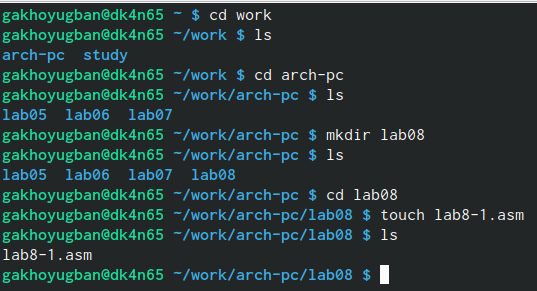{#fig:001 width=70%}

Я написал текст программы для вывода значений регистра ecx, что демонстрирую вам на риснуке(рис. @fig:002)

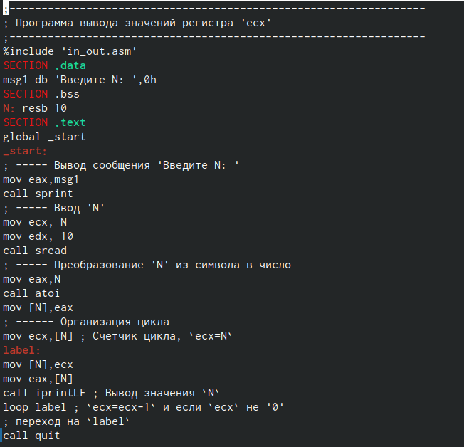{#fig:002 width=70%}

Перевел файл lab8-1.asm в объектный, сделал компоновку и отправил на исполнение.В итоге вместо n я ввел число 10, на что мне программа выдала последовательность чисел от 10 до 1 включительно. Чтобы окончательно проверить программу я ввел вместо n 5, что дало мне убедиться, что программа работает верно(рис. @fig:003)

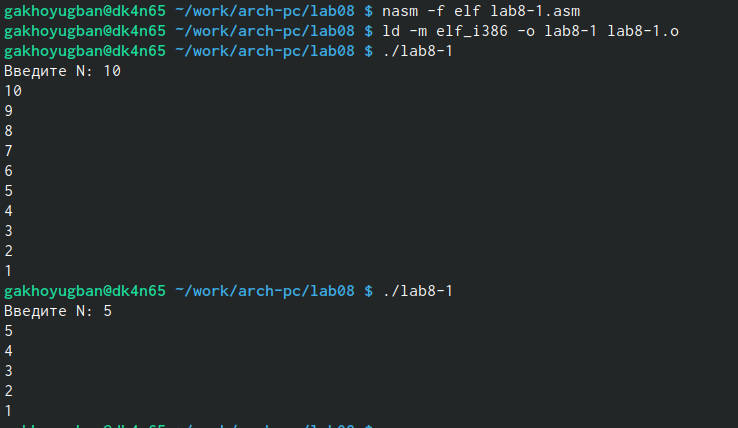{#fig:003 width=70%}

Затем по ходу лабораторной работы от меня требуется изменить текст программы файла lab8-1.asm. Для чего я и создаю файл lab8-2.asm, что я вам показываю гна руиснуке(рис. @fig:004)

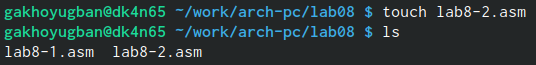{#fig:004 width=70%}

Я изменил текст прграммы, использовава регистр ecx в теле цикла loop. А сам текст программы на рисунке(рис. @fig:005)

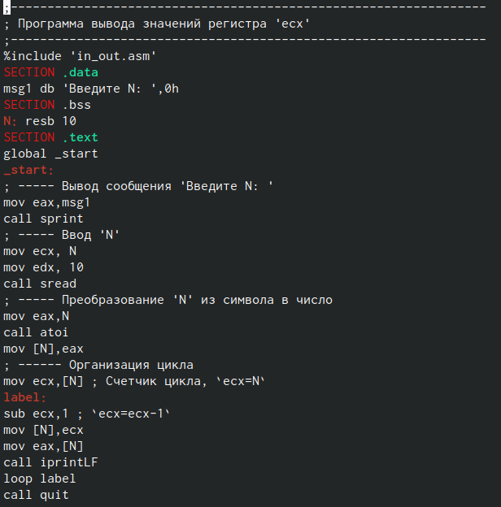{#fig:005 width=70%}

Перевел файл lab8-2.asm в объектный, сделал компоновку и отправил на исполнение.Сначала я ввел число 5, что выдало мне что-то непонятное. А затем я ввел число 10 и программа вывела последовательно все числа от 10 до 1, которые являются нечетными(рис. @fig:006)

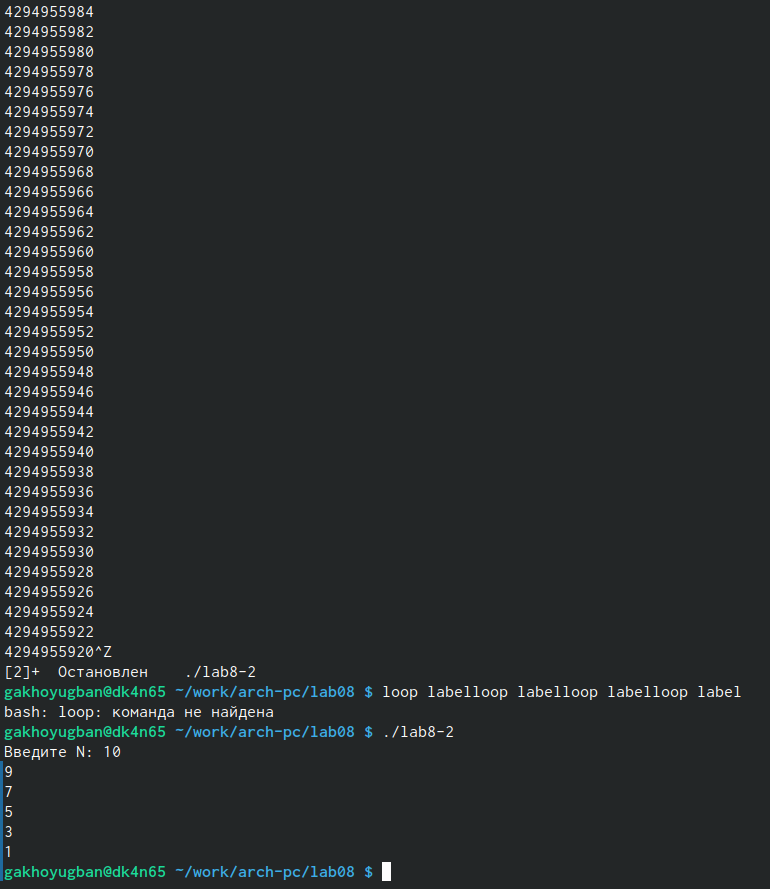{#fig:006 width=70%}

Затем по ходу лабораторной работы от меня требуется изменить снова текст программы файла lab8-2.asm. Для чего я и создаю файл lab8-3.asm, что я вам показываю гна руиснуке(рис. @fig:007)

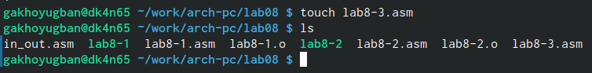{#fig:007 width=70%}

Я изменил текст прграммы, добавив команды push и pop для сохранения значения счетчика цикла loop. А сам текст программы на рисунке(рис. @fig:008)

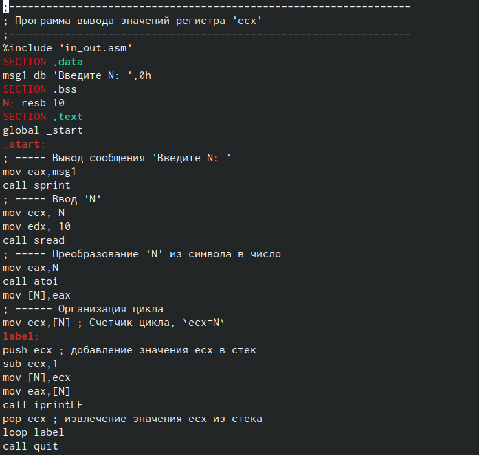{#fig:008 width=70%}

Перевел файл lab8-3.asm в объектный, сделал компоновку и отправил на исполнение.Сначала, введя число 10 в n, я могу сделать вывод, что числа идут от 10 до 1 но не включительно 10. А затем, введя число 5 вместо n, я удостоверился в работе программы(рис. @fig:009)

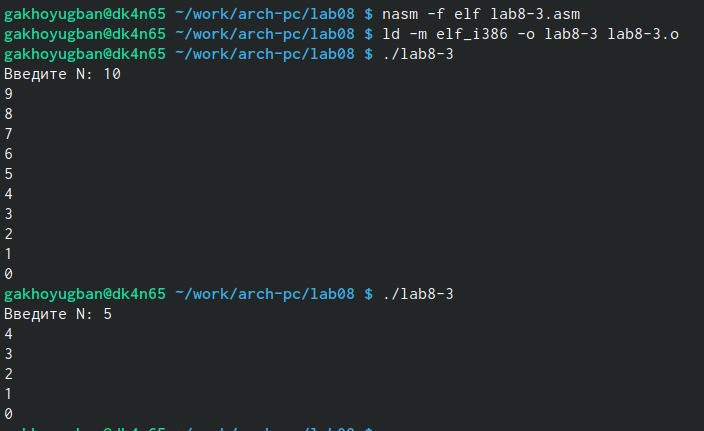{#fig:009 width=70%}

Затем мне требуется написать еще одну программу, для чего я создаю файл lab8-4.asm(рис. @fig:010)

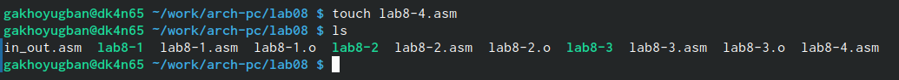{#fig:010 width=70%}

По ходу лабораторной программы надо переписать текст программы выводящую на экран аргументной, а затем мне требуется написать еще одну программу, для чего я создаю файл lab8-4.asm командной строки, что я вам показываю на рисунке(рис. @fig:011)

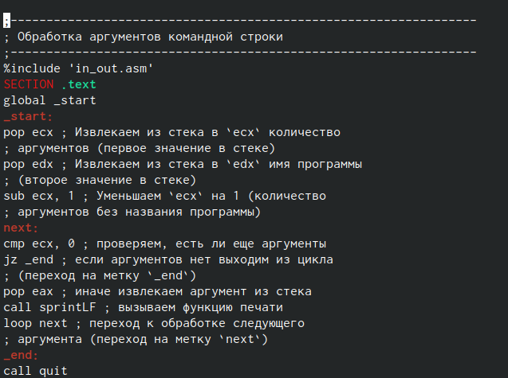{#fig:011 width=70%}

Перевел файл lab8-4.asm в объектный, сделал компоновку и отправил на исполнение.Я ввел три аргумента, как и требовалось по лабораторной работы, что мне выдало ровно 5 аргументов(рис. @fig:012)

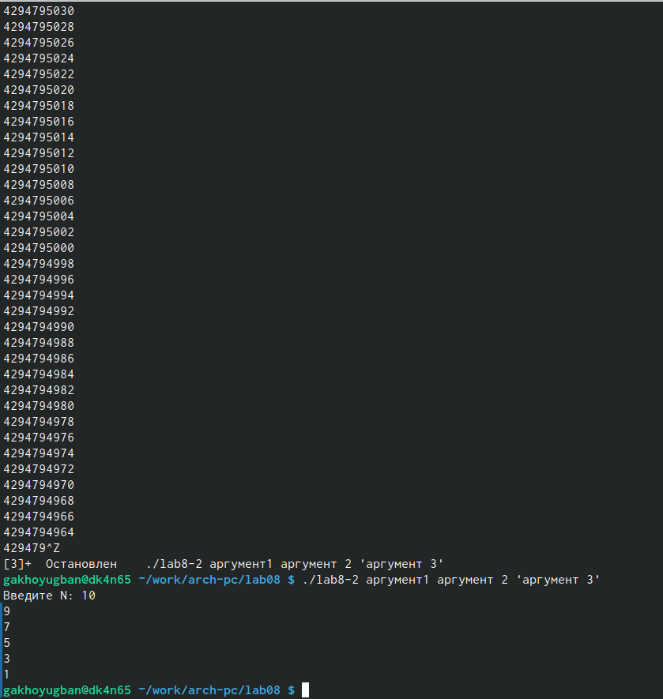{#fig:012 width=70%}

Затем мне требуется написать еще одну программу, для чего я создаю файл lab8-5.asm(рис. @fig:013)

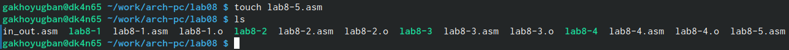{#fig:013 width=70%}

По ходу лабораторной программы надо переписать текст программы вычисления суммы аргументов на экран аргументной. Текст программы на рисунке(рис. @fig:014)

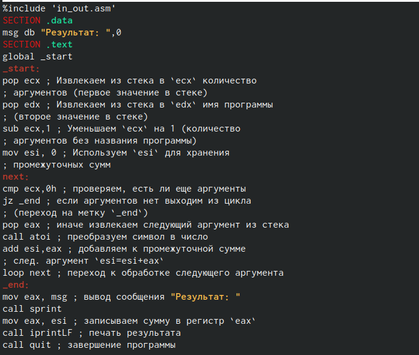{#fig:014 width=70%}

Перевел файл lab8-5.asm в объектный, сделал компоновку и отправил на исполнение. Сначала, введя несколько аргументов, которые требовалось ввести по ходу лабораторной работы, я удостоверился, что программа работает верно. Затем, введя числа от 1 до 5, я уже окончательно понял, что программа работает верно, так как ответ программы был 15, а 1+2+3+4+5=15(рис. @fig:015)

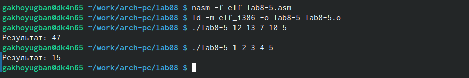{#fig:015 width=70%}

Мне требовалось решить последний пункт лабораторной работы, для чего я и создал файл lab8-6.asm(рис. @fig:016)

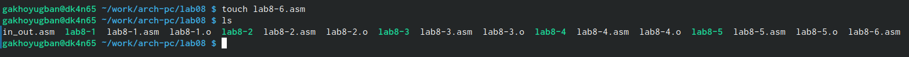{#fig:016 width=70%}

Мне требовалось изменить текст программы lab8-5.asm, чтобы программа не складывала все введенные аргументы, а перемножала. Я изменил текст программы для выполнения этой задачи, что демонстрирую на рисунке(рис. @fig:017)

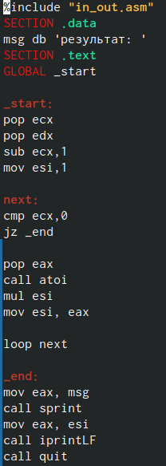{#fig:017 width=70%}

Перевел файл lab8-6.asm в объектный, сделал компоновку и отправил на исполнение.Чтобы удоствореиться в решении моей программы, я ввел числа от 1 до 5 включительно. В результате, я получил верное решение, так как 1*2*3*4*5=120(рис. @fig:018)

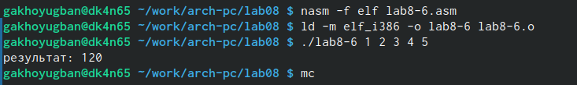{#fig:018 width=70%}

# Выполнение самостоятельной работы

Для решения самостоятельной работы я создам отедльный файл lab8-7.asm(рис. @fig:019)

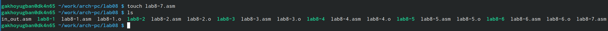{#fig:019 width=70%}

Я напишу текст программы для решения, что я демонстрирую вам на рисунке(рис. @fig:020)

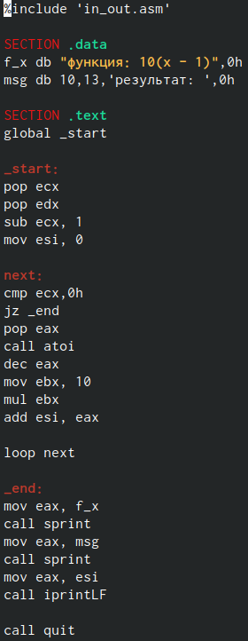{#fig:020 width=70%}

# Выводы

Были получены знания по организации циклов и работе стеков на языке NASM

