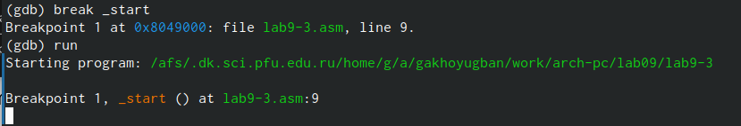

---
## Front mattertitle:
title: "Отчёт по лабораторной работе № 9"
subtitle: "Дисцпилина: Архитектура компьютеров"
author: "Хоюгбан Ганчыыр Анатольевич"

## Generic otions
lang: ru-RU
toc-title: "Содержание"

## Bibliography
bibliography: bib/cite.bib
csl: pandoc/csl/gost-r-7-0-5-2008-numeric.csl

## Pdf output format
toc: true # Table of contents
toc-depth: 2
lof: true # List of figures
lot: true # List of tables
fontsize: 12pt
linestretch: 1.5
papersize: a4
documentclass: scrreprt
## I18n polyglossia
polyglossia-lang:
  name: russian
  options:
	- spelling=modern
	- babelshorthands=true
polyglossia-otherlangs:
  name: english
## I18n babel
babel-lang: russian
babel-otherlangs: english
## Fonts
mainfont: PT Serif
romanfont: PT Serif
sansfont: PT Sans
monofont: PT Mono
mainfontoptions: Ligatures=TeX
romanfontoptions: Ligatures=TeX
sansfontoptions: Ligatures=TeX,Scale=MatchLowercase
monofontoptions: Scale=MatchLowercase,Scale=0.9
## Biblatex
biblatex: true
biblio-style: "gost-numeric"
biblatexoptions:
  - parentracker=true
  - backend=biber
  - hyperref=auto
  - language=auto
  - autolang=other*
  - citestyle=gost-numeric
## Pandoc-crossref LaTeX customization
figureTitle: "Рис."
tableTitle: "Таблица"
listingTitle: "Листинг"
lofTitle: "Список иллюстраций"
lotTitle: "Список таблиц"
lolTitle: "Листинги"
## Misc options
indent: true
header-includes:
  - \usepackage{indentfirst}
  - \usepackage{float} # keep figures where there are in the text
  - \floatplacement{figure}{H} # keep figures where there are in the text
---

# Цель работы

Приобретение навыков написания программ с использованием подпрограмм. Знакомство
с методами отладки при помощи GDB и его основными возможностями.

# Выполнение лабораторной работы

Для начала открыл терминал, перехожу на каталог, через которую буду выполнять 9 лабораторную, а затем создаю файл lab9-1.asm(рис. @fig:001)

{#fig:001 width=70%}

Написал текст прогрммы с использованием вызова подпрограммы, что я демонстрирую вам на рисунке(рис. @fig:002)

{#fig:002 width=70%}

Перевел файл lab9-1.asm в объектный, сделал компоновку и отправил на исполнение, куда в итоге ввел значения 1 и 2(рис. @fig:003)

{#fig:003 width=70%}

Изменил текст программы, как требует лабораторная, для вновь созданного файла lab9-2.asm, что показываю на рисунке (рис. @fig:004)

{#fig:004 width=70%}

Перевел файл lab9-2.asm в объектный, сделал компоновку и отправил на исполнение, куда в итоге ввел значения 1 и 2(рис. @fig:005)

{#fig:005 width=70%}

Напечатал текст программы для вызова сообщения Hello world!, что показываю на рисунке(рис. @fig:006)

{#fig:006 width=70%}

Перевел файл lab9-3.asm в объектный, сделал компоновку и отправил на исполнени, где открылся отладчик gdb(рис. @fig:007)

{#fig:007 width=70%}

Проверил работу программы, запустив ее в оболочке gdb с помощью команды run(рис. @fig:008)

{#fig:008 width=70%}

Установил брейкпоинг а метку _start, с которой начинается выполнение любой ассемблерной программы, а затем запустил ее(рис. @fig:009)

{#fig:009 width=70%}

Посмотрел дисассимилированный код программы с помощью  disassemle(рис. @fig:010)

{#fig:010 width=70%}

Переключился на отображение команд с Intelовским синтаксисом, введя команду set(рис. @fig:011)

{#fig:011 width=70%}

Включил режим псевдографики для удобного аналища программы(рис. @fig:012)

{#fig:012 width=70%}

Проверяю точку остновки по имени _start(рис. @fig:013)

{#fig:013 width=70%}

Смотрю информацию о всех установленных точках останова с помощью команды i b (рис. @fig:014)

{#fig:014 width=70%}

Посмотрел значени переменной msg2 по адресу, а затем изменяю первый символ в переменной msg1(рис. @fig:015)

{#fig:015 width=70%}

Изменил значение первого символа переменной msg2(рис. @fig:016)

{#fig:016 width=70%}

Примеры использования команды print(рис. @fig:017)

{#fig:017 width=70%}

С помощью команды set изменяю значение регистра ebx. Разница вывода из-за того что в первом случае 2 это символ а во втором число(рис. @fig:018)

{#fig:018 width=70%}

Скопировал файл lab8-2.asm, созданный при выполнении лабораторной работы №8, в файл lab9-4.asm (рис. @fig:019)

{#fig:019 width=70%}

Запускаю программу в оболочке gdb (рис. @fig:020)

{#fig:020 width=70%}

Узнаю количество аргументов, а затем смотрю все позиции стека. Их адреса распологаются в 4 байтах друг от друга(рис. @fig:021)

{#fig:021 width=70%}

# Выполнение самостоятельной работы

Для выполнение самостоятельной работы беру текст файла из лабораторной №8, но с использованием подпрограмм. Текст программы демонстрирую на рисунке(рис. @fig:022)

{#fig:022 width=70%}

Перевел файл lab9-5.asm в объектный, сделал компоновку и отправил на исполнение, куда в итоге ввел аргументы 1 2 3 4(рис. @fig:023)

{#fig:023 width=70%}

Затем я отредактировал файл, нашел некоторые несостыковки при использлвании отладчика и нашел ошибки в строках, а именно:
add ebx, eax
mov ecx,4
mul ecx 
add ebx,5
mov edi,ebx
Я исправил текст программы и демонстрирую вам исправленный код(рис. @fig:024)

{#fig:024 width=70%}

Перевел файл lab9-6.asm в объектный, сделал компоновку и отправил на исполнение, откуда получил в результате 25(рис. @fig:025)

{#fig:025 width=70%}

# Вывод

В результате выполнение лабораторной работы, я научился организовывать код в подпрограммы и познакомился с базовыми функциями отладчика gdb

