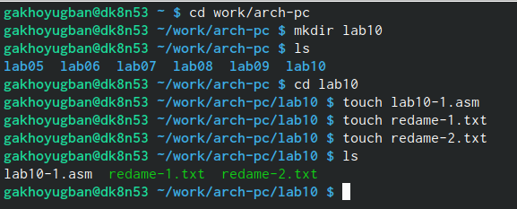
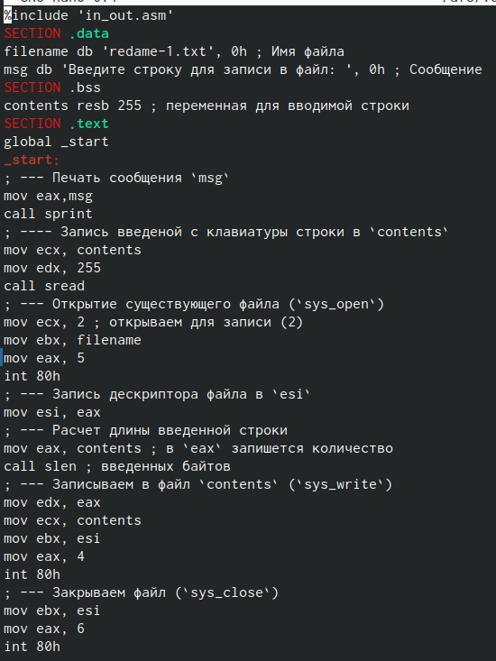
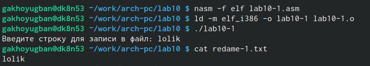
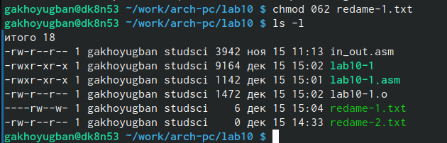
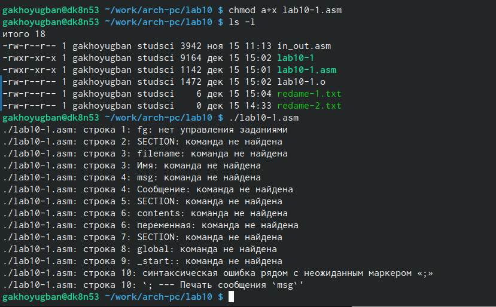
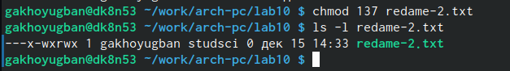
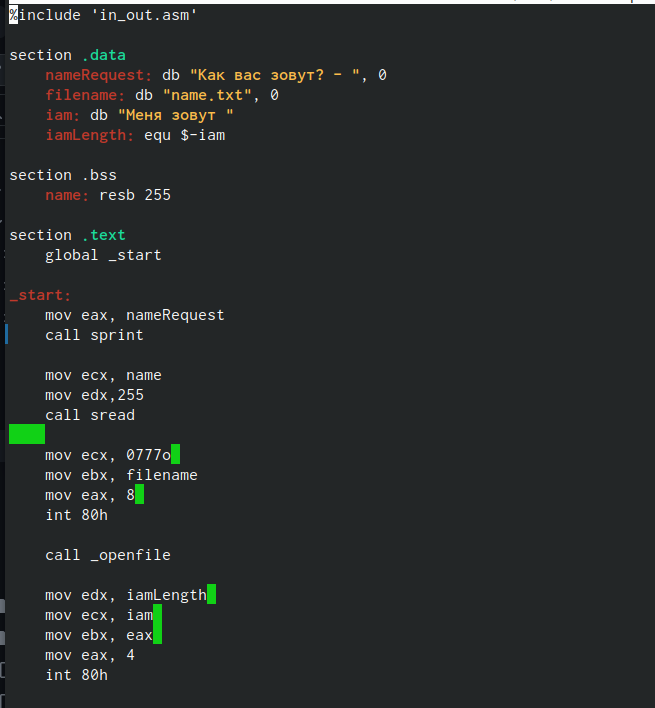
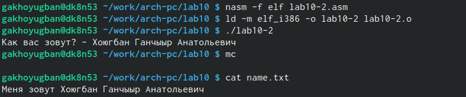

---
## Front matter
title: "Отчёт по лабораторной работе №10"
subtitle: "Дисциплина: Хоюгбан Ганчыыр Анатольевич"
author: "Хоюгбан Ганчыыр Анатольевич"

## Generic otions
lang: ru-RU
toc-title: "Содержание"

## Bibliography
bibliography: bib/cite.bib
csl: pandoc/csl/gost-r-7-0-5-2008-numeric.csl

## Pdf output format
toc: true # Table of contents
toc-depth: 2
lof: true # List of figures
lot: true # List of tables
fontsize: 12pt
linestretch: 1.5
papersize: a4
documentclass: scrreprt
## I18n polyglossia
polyglossia-lang:
  name: russian
  options:
	- spelling=modern
	- babelshorthands=true
polyglossia-otherlangs:
  name: english
## I18n babel
babel-lang: russian
babel-otherlangs: english
## Fonts
mainfont: PT Serif
romanfont: PT Serif
sansfont: PT Sans
monofont: PT Mono
mainfontoptions: Ligatures=TeX
romanfontoptions: Ligatures=TeX
sansfontoptions: Ligatures=TeX,Scale=MatchLowercase
monofontoptions: Scale=MatchLowercase,Scale=0.9
## Biblatex
biblatex: true
biblio-style: "gost-numeric"
biblatexoptions:
  - parentracker=true
  - backend=biber
  - hyperref=auto
  - language=auto
  - autolang=other*
  - citestyle=gost-numeric
## Pandoc-crossref LaTeX customization
figureTitle: "Рис."
tableTitle: "Таблица"
listingTitle: "Листинг"
lofTitle: "Список иллюстраций"
lotTitle: "Список таблиц"
lolTitle: "Листинги"
## Misc options
indent: true
header-includes:
  - \usepackage{indentfirst}
  - \usepackage{float} # keep figures where there are in the text
  - \floatplacement{figure}{H} # keep figures where there are in the text
---

# Цель работы

Приобретение навыков написания программ для работы с файлами.

# Выполнение лабораторной работы

Описываются проведённые действия, в качестве иллюстрации даётся ссылка на иллюстрацию (рис. @fig:001).

{#fig:001 width=70%}

Перешел в свой каталог arch-pc, затем создал каталог для 10 лабораторной, перешел в него и создал три файла для выполнения лабораторной: lab10-1.asm, redame-1.txt, redame-2.txt(рис. @fig:001)

{#fig:001 width=70%}

Затем по ходу лабораторной работы от меня требуется написать программу записи в файл сообщения, что показываю вам на рисунке (рис. @fig:002)

{#fig:002 width=70%}

Отправил файл lab10-1.asm в объектный файл, сделал компоновку и отправил на исполнение. Затем от меня требуется ввести в файл redame-1.txt любой текст, куда я ввожу  lolik. C помощью команды cat вызываю текст, который я ввел(рис. @fig:003)

{#fig:003 width=70%}

С помощью команды chmode запрещаю исполнение файла lab10-1 и попробую исполнить его. Как я и думал, программа не запустилась (рис. @fig:004)

{#fig:004 width=70%}

С помощью команды chmode разрешаю исполнение файла lab10-1.asm и пробую исполнять его. Много ошибок, так как файл такого типа не предназначен для такого использования (рис. @fig:005)

{#fig:005 width=70%}

C помощью команды chmode изменяю права доступа к файлу redame-1.txt. С помощью команды ls -l убеждаюсь в правильности выполнения задания(рис. @fig:006)

{#fig:006 width=70%}

С помощью команды chmode изменяю права доступа к файлу redame-2.txt в соответсвии с 20 вариантом. С помощью команды ls -l убеждаюсь в правильности выполнения задания(рис. @fig:007)

{#fig:007 width=70%}

# Самостоятельная работа 

Создал для начала файл lab10-2.asm, в который ввожу текст программы, которая спрашивает как меня зовут, а потом записывает это в созданный ею же файл (рис. @fig:008)

{#fig:008 width=70%}

Отправил файл lab10-1.asm в объектный файл, сделал компоновку и отправил на исполнение. Куда ввожу свое ФИО. Затем с помощью команды cat вызываю из файла name.txt то, что я ввел и получил мое ФИО(рис. @fig:009)

{#fig:009 width=70%}

# Вывод

Я приобрел навыки по работе с файлами NASM и правами доступа к файлам

